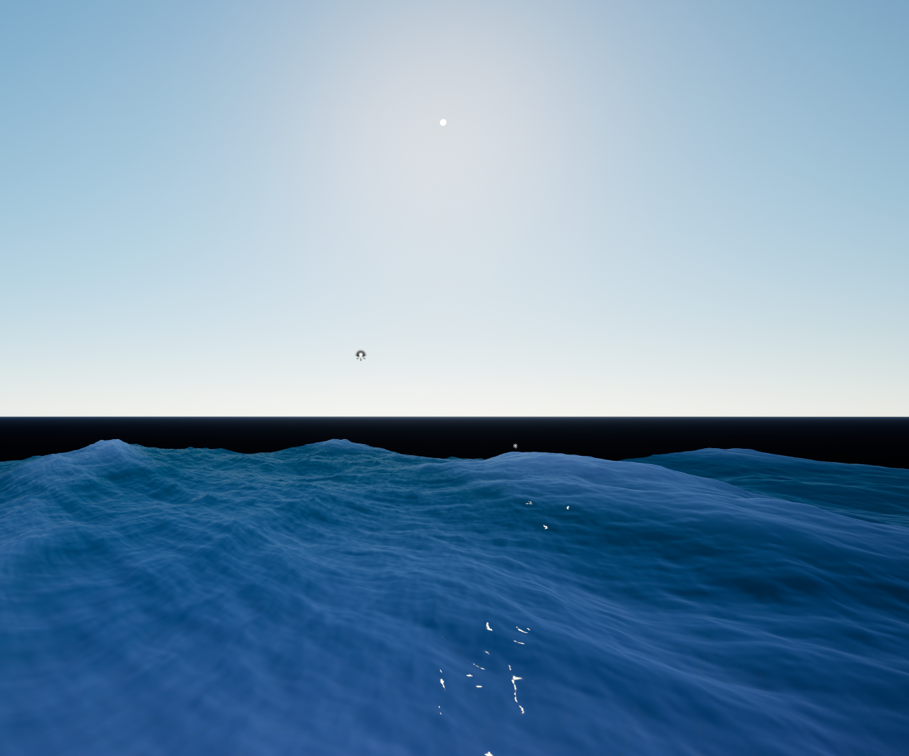

### Roadmap

- [x] Generate Butterfly texture
- [x] Generate initial spectra texture
- [x] Generate time-dependent Fourier component textures
- [x] Generate height map texture
- [x] Generate height and choppiness (X, Y) map textures
- [x] Add temporary water shader
- [ ] Add proper water shader
- [ ] Add foam
- [ ] Add buoyancy

